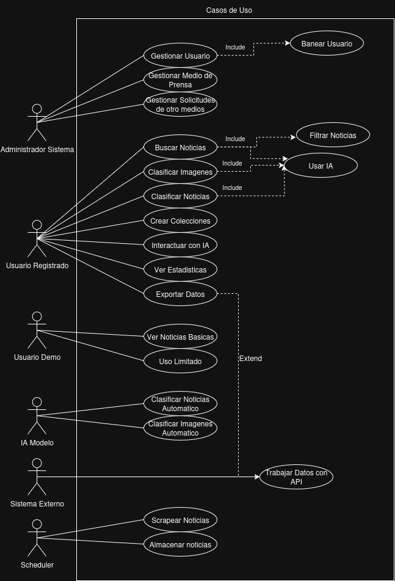

# ADS

### Descripcion
 Este diagrama describe un sistema escalable y automatizado que permite que mas medios se asocien al programa. Al integrar funciones de IA para clasificar noticias e imagenes, e interactuar directamente con el usuario lo vuelve capaz de hacer analisis inteligentes. Su multiple clasificacion de usuarios y administradores, asi como sus demas entidades le permiten adaptarse a hacer analisis de investigacion y monitoreo para uso comercial.
